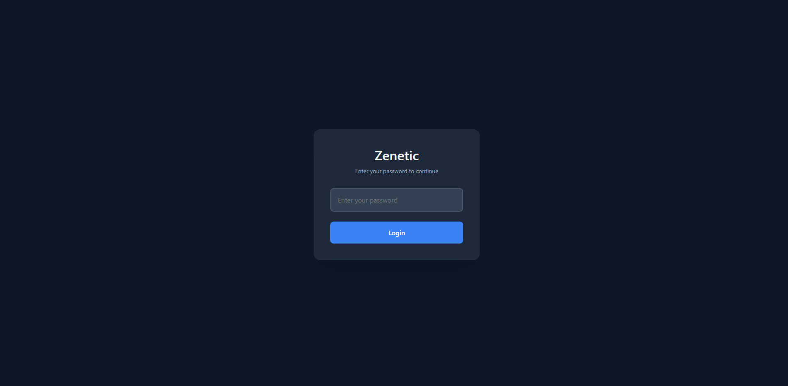

# Zenetic - Your Personal Productivity Sanctuary 🌟

> A thoughtfully designed productivity application, initially developed for personal use and now open-sourced to empower others in their productivity journey.

[](https://opensource.org/licenses/ISC)
[](https://www.typescriptlang.org/)
[](https://nodejs.org/)
[](https://expressjs.com/)

## 🎯 Overview

Zenetic is a comprehensive productivity application that enables users to manage tasks, maintain journals, monitor thoughts, emotions, and behavioral patterns, and analyze them through intuitive visualizations and statistical insights. While originally developed as a personal tool, it has been open-sourced to enable others to create their own productivity sanctuary.

The name "Zenetic" is a portmanteau of "Zen" and "Genetic," reflecting the application's focus on achieving mindfulness and understanding one's inherent patterns.

### ✨ Key Features

- **Task Management**
  - Create one-time and recurring tasks
  - Monitor task completion and progress
  - Automated tracking for periodic tasks (weekly, bi-weekly, monthly)

- **Journaling**
  - Maintain daily journal entries
  - Document and track your personal narrative
  - Secure, private journaling environment

- **Observations & Analytics**
  - Monitor thought patterns, emotional states, and behavioral tendencies
  - Implementation of practices from Zenoga (By PJ Saher)
  - Comprehensive analytics of cognitive and emotional patterns
  - Gain insights into personal tendencies and behavioral patterns

- **Drift Tracking**
  - Implementation of the Drift Watching practice from Zenoga (By PJ Saher)
  - Monitor and analyze attention patterns
  - Visual representation of focus patterns through detailed graphs

## 🛠️ Tech Stack

- **Backend**
  - Node.js with Express
  - TypeScript
  - MongoDB with Mongoose
  - Winston (Logging)
  - EJS (Templating)

- **Security & Utilities**
  - bcrypt (Authentication)
  - compression
  - dotenv
  - cookie management

## 🚀 Getting Started

### Prerequisites

- Node.js (Latest LTS version)
- MongoDB
- Git

### Installation

1. Clone the repository
   ```bash
   git clone https://github.com/rishu074/zenetic.git
   cd zenetic
   ```

2. Install dependencies
   ```bash
   npm install
   ```

3. Configure environment variables
   Create a `.env` file in the root directory with the following variables:
   ```env
    PORT=8989
    NODE_ENV=development
    HOST=0.0.0.0
    HTTPS=false
    CONSOLE_LOG_LEVEL=info
    APP_LOGS=logs
    MONGO_DB=mongodb://localhost:27017/zenetic
    PASSWORD_HASH="$2a$10$7RiPHTfshhpMPKNAxD154OA354qmbGGnK5aoipqZWDO3irBeQpFki"
   ```

4. Build and run the application
   ```bash
   # For development
   npm run dev

   # For production
   npm run build
   npm start
   ```

## 📱 Usage Guide

1. **Initial Setup**
   - Complete the installation process
   - Configure the environment variables
   - Generate a password hash using https://bcrypt-generator.com/ (10 rounds)
   - Launch the application using your configured password

2. **Daily Usage**
   - Task management and tracking
   - Journal entry creation
   - Thought pattern observation
   - Drift monitoring

3. **Analytics & Insights**
   - Review task completion metrics
   - Access journal archives
   - Analyze thought and emotional patterns
   - Examine drift tracking data

## 📸 Screenshots

### Login Page


### Feature Demonstrations (Video Walkthroughs)

1. **First Look**
   <video width="100%" controls>
     <source src="screenshots/first_look.mp4" type="video/mp4">
     Your browser does not support the video tag.
   </video>

2. **Todo Management**
   <video width="100%" controls>
     <source src="screenshots/todo_example.mp4" type="video/mp4">
     Your browser does not support the video tag.
   </video>

3. **Journaling**
   <video width="100%" controls>
     <source src="screenshots/journal_example.mp4" type="video/mp4">
     Your browser does not support the video tag.
   </video>

4. **Observations**
   <video width="100%" controls>
     <source src="screenshots/observation_example.mp4" type="video/mp4">
     Your browser does not support the video tag.
   </video>

5. **Drift Tracking**
   <video width="100%" controls>
     <source src="screenshots/drifts_example.mp4" type="video/mp4">
     Your browser does not support the video tag.
   </video>

## 🤝 Contributing

Well contributing is a good thing, but honestly, I dont want to maintain this project because I dont get time. You can fork this and make your own version of zenetic.

## 📄 License

This project is licensed under the ISC License - see the [LICENSE](LICENSE) file for details.

## 🙏 Credits

- Zenoga - Book By PJ Saher (Highly recommended)
- Express.js - Web application framework
- MongoDB - Database
- Winston - Logging
- And all other open-source libraries used in this project
---

Made with dedication by Rishu
